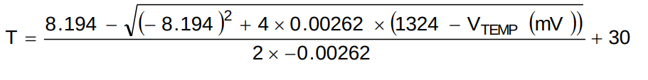
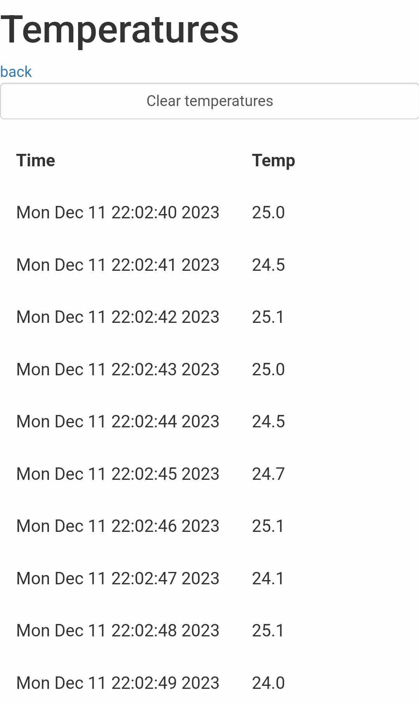

\pagebreak

# Úvod

Program je napsán v jazyce C++ a je určen pro desku Wemos D1 R32(ESP32).

Program periodicky každých 500ms měří teplotu a ukládá ji společně s časovými razítky získanými pomocí RTC do paměti. Program také spustí server, a připojí se na wifi, konfigurace wifi je v idf menuconfig.
Na adrese, která mu byla přidělena běží webové rozhraní, kde vypisuje aktuální teplotu. Lze také nastavit hranice teploty, při jejímž překročení zhasne LED. Tato hranice má hysterezi 3 °C (lze změnit v idf menuconfig).

Webové rozhraní také obsahuje možnost zobrazení historie teploty. Tato historie je zobrazena v tabulce. V tabulce je zobrazena teplota, datum a čas naměření.
V tomto zobrazení je také tlačítko na smazání historie.

# Návod

## Zapojení

Čidlo LMT85LPG, je třeba připojit k 3.3V a GND desky Wemos D1 r32. Výstupní signál čidla je třeba zapojit k pinu IO35. LED se připojí přes rezistor k pinu IO2 a GND. LED je spínaná logickou 1.

{ width=250px }
{ width=250px }

## Nastavení

Základní nastavení aplikace je pomocí IDF menuconfig (`idf.py menuconfig`). Jde zde nastavit SSID, heslo a další nastavení wifi. Také je možné zde nastavit hysterezi teploty.

{ width=250px }

### Nastavení wifi

Je nutné nastavit SSID a heslo. Wifi se připojuje při startu programu a uživateli je v terminálu přes UART vypsáno, na jaké adrese je server dostupný.

## Nastavení hranice teploty

Hranice teploty se nastavuje pomocí webového rozhraní. Toto rozhraní je dostupné na adrese, které je vypsáno přes UART do terminálu. Při překročení hranice teploty se LED zhasne, při poklesu pod hranici se LED rozsvítí. Je zde také hystereze 3 °C, která je možná přenastavit v menuconfig.

## Smazání paměti

Paměť se maže pomocí webového rozhraní. Na adrese http://ipadresa/getTemps je možné zobrazit historii teplot. Na této stránce je také tlačítko na smazání historie.

## Nahrání programu

Program se nahraje do Wemos D1 R32 pomocí příkazu `idf.py flash monitor`. Parametr `flash` přeloží program a nahraje ho do mikroprocesoru. Parametr `monitor` spustí monitorování výstupu z UART, kde se vypíše stav připojení, ip adresa web serveru a následně se vypisuje napětí a teplota.

## Připojení k serveru

Po připojení k wifi se vypíše ip adresa serveru přes UART. Na této adrese je dostupné webové rozhraní.

# Způsob realizace

## Program

Program byl napsán v jazyce C++ a je určen pro desku Wemos D1 R32(ESP32).

## hlavní smyčka

{ width=200px }
{ width=400px }

## Použité knihovny

V programu se používají pouze základní knihovny pro ESP32. Všechny knihovny jsou součástí ESP-IDF.

### Měření teploty

Hodnota z čidla je za použití časového přerušení získávána každých 500ms z pinu I035 pomocí ADC převodníku. Tato hodnota je převáděna pomocí následujícího vzorce na teplotu v °C. Vzorec je převzat z datasheetu čidla LMT85. [2]

### Ukládání teploty

Teplota je ukládána do nevolatilní paměti pomocí NVS knihovny s časovým razítkem získaných z RTC.

### RTC

RTC je při restartu inicializováno ze serveru pool.ntp.org. Časová zóna je nastavena na GMT+2.

### Web server

Web server byl vytvořen pomocí esp esp_http_server knihovny. Web server obsahuje 2 stránky. První stránka obsahuje aktuální teplotu. Druhá stránka obsahuje historii teplot.

Teplota je aktualizována každých 500ms pomocí javascriptu, který posílá periodicky každou 1s GET request na server.

Každá url adresa, má přiřazenou funkci, která se spustí při přístupu na tuto adresu. Funkce vrací html kód, který se má zobrazit.

{ width=250px }
{ width=250px }

# Zdroje

- [1] esp idf api: https://docs.espressif.com/projects/esp-idf/en/latest/esp32/api-reference/
- [2] datasheet: https://www.ti.com/lit/ds/symlink/lmt85.pdf?ts=1696975223474

