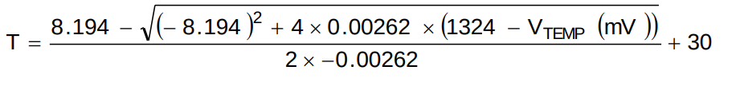
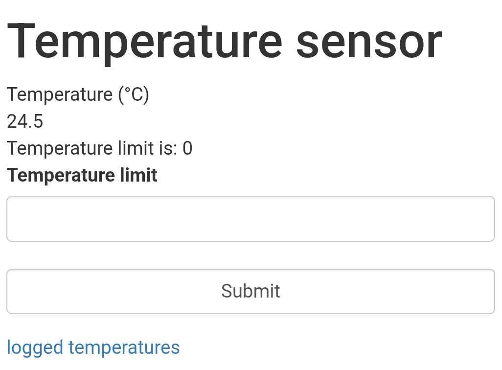
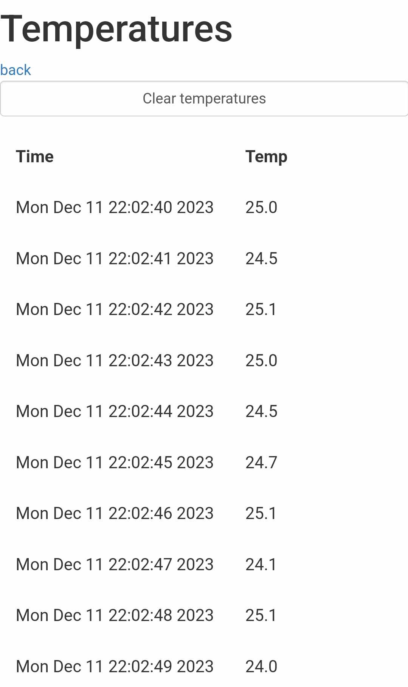

\pagebreak

# Úvod

Tento dokument slouží jako dokumentace k projektu měření teploty. V dokumentu je popsán návrh a realizace.

Program je napsán v jazyce C++ a je určen pro mikrokontrolér ESP32.

Program periodicky každých 0.5s měří teplotu a ukládá ji společně s časovými razítky získané pomocí RTC do paměti. Program také spustí server, a připojí se na wifi, ke které jdou nastavit údaje pomocí idf menuconfig.
Na adrese, která mu byla přidělena vypisuje aktuální teplotu. Lze také nastavit hranice teploty, při které se rozsvítí led dioda. Tato hranice má histerezi 1 °C.

Webové rozhraní také obsahuje možnost zobrazení historie teploty. Tato historie je zobrazena v tabulce. V tabulce je zobrazena teplota, datum a čas naměření.
V tomto zobrazení je také tlačítko na smazání historie.

# Návod

## Zapojení

Čidlo LMT85LPG, je třeba připojit k 3.3V a GND desky Wemos D1 r32. Výstupní signál čidla je třeba zapojit k pinu IO36. Led dioda se připojí přes rezistor k pinu IO2 a GND. Je spínaná logickou 1.

## Nastavení wifi

Wifi se nastavuje pomocí idf menuconfig. Je nutné nastavit SSID a heslo. Wifi se připojuje při startu programu a uživateli je v konzoli vypsáno, na jaké adrese je server dostupný.

## Nastavení hranice teploty

Hranice teploty se nastavuje pomocí webového rozhraní. Na adrese, která je vypsána v konzoli, je dostupné webové rozhraní. Na této stránce je možné nastavit hranice teploty. Tato hranice má histerezi 1 °C.

## Smazání paměti

Paměť se maže pomocí webového rozhraní. Na adrese http://ipadresa/getTemps je možné zobrazit historii teplot. Na této stránce je tlačítko na smazání historie.

# Způsob realizace

## Program

Program byl napsán v jazyce C++ a je určen pro mikrokontrolér ESP32.

### Měření teploty

Hodnota z čidla je za použití časového přerušení získávána každou 0.5s pomocí ADC převodníku. Tato hodnota je převáděna pomocí následujícího vzorce na teplotu v °C.

### Ukládání teploty

Teplota je ukládána do paměti pomocí NVS.

### Webserver

Webserver byl vytvořen pomocí ESP-IDF knihovny k tomu určené. Webserver obsahuje 2 stránky. První stránka obsahuje aktuální teplotu. Druhá stránka obsahuje historii teplot.

Templota je aktualizována každou 0.5s pomocí javascriptu, který posílá GET request na server.

Každá url adresa, má přiřazenou funkci, která se spustí při přístupu na tuto adresu. Funkce vrací html kód, který se má zobrazit.

{ width=250px }
{ width=250px }

# Zdroje

- https://docs.espressif.com/projects/esp-idf/en/latest/esp32/api-reference/
- https://www.ti.com/lit/ds/symlink/lmt85.pdf?ts=1696975223474&ref_url=https%253A%252F%252Fwww.google.com%252F

